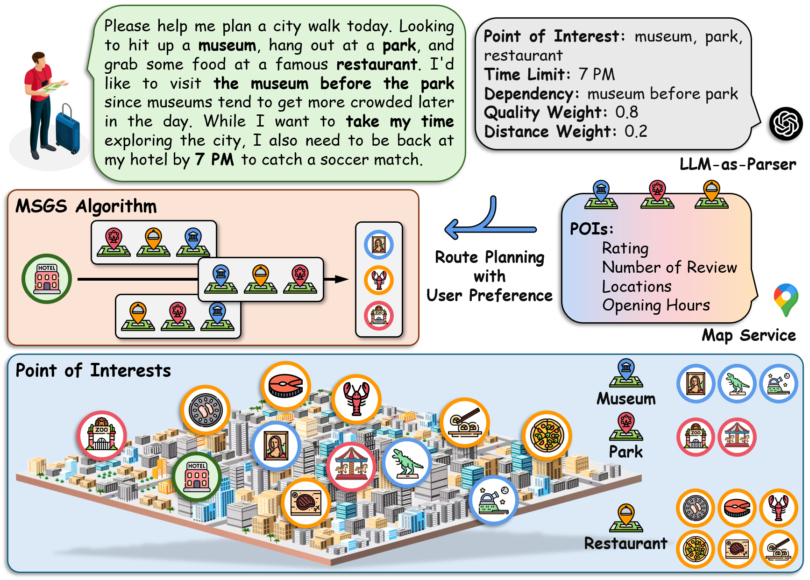
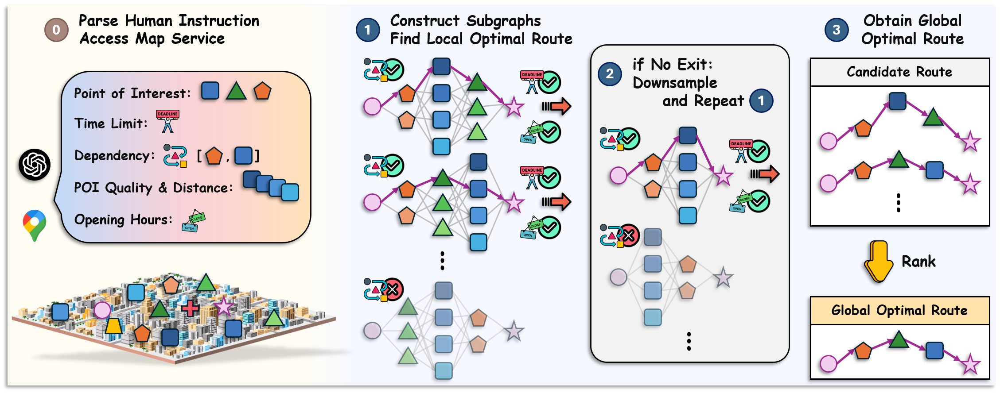

## LLMAP: LLM-Assisted Multi-Objective Route Planning with User Preferences

[](https://www.python.org/downloads/release/python-31012/)
[](https://opensource.org/licenses/MIT) 

**TL;DR:** We propose a route planning system that uses LLM-as-Parser to interpret natural language and extract user preferences, and employs a multi-step graph search to trade off human objectives under multiple constraints.

## 🗺️ Use Case: City Tours


- **User:** *Please help me plan a city walk today. Looking to hit up a **museum**, hang out at a **park**, and grab some food at a famous **restaurant**. I'd like to visit **the museum before the park** since museums tend to get more crowded later in the day. While I want to **take my time** exploring the city, I also need to be back at my hotel by **7 PM** to catch a soccer match.*
- **LLM-as-Parser:** **Point of Interest:** museum, park, restaurant, **Time Limit:** 7 PM, **Dependency:** museum before park, **Quality Weight:** 0.8, **Distance Weight:** 0.2
- **Planned Route:** hotel -> art museum -> lobster restaurant -> zoo -> hotel

<div align="center">
    
</div>


## 🔥 Our Framework

We present **LLMAP** (LLM-Assisted Route Planning) system and **MSGS** (Multi-Step Graph Construction with Iterative Search) algorithm. After the LLM-as-Parser interprets the human instruction and retrieves POI information from the map service, we employ the \AlgName algorithm to identify the optimal route. We utilize a multi-step graph construction approach where local optimal paths are first obtained on subgraphs using the Dijkstra algorithm, followed by the integration of these local optimal paths to achieve global route optimization. Dependency constraints are verified before subgraph construction, while time limits and opening hours are validated after obtaining local optimal paths.

<div align="center">
    
</div>


## 🖥️ Prerequisites

Install the required packages via:
```bash
pip install -r requirements.txt
```

Alternatively, ensure the following dependencies are installed:
```plaintext
python == 3.10.12
numpy == 1.26.4
torch == 2.2.1
haversine == 2.8.1
networkx == 2.8.8
openai == 1.9.0
transformers == 4.45.2
pandas == 2.2.2
googlemaps == 4.10.0
```


## 🗂️ Folder Structure
```
LCIO/
│   README.md
│   requirements.txt
│
├─── main/
│   │   main.py
│   │   utils.py
│
├─── data/
│   │   HIPP.py
│   │   HIPP.json
```

- **`main/`**: Contains the primary codebase.
  - `main.py`: Entry point of the system.
  - `utils.py`: Contains utility functions for tasks like data processing, env, and evaluation.
  - `results/`: Stores output files and results generated by the system.
- **`data/`**: Stores the HIPP dataset.
  - `HIPP.py`: Generate the HIPP dataset.


## 🏃‍♂ Run Code

Generate the dataset with the following command:
```bash
python data/HIPP.py
```

Run the system with the following command:
```bash
python main/main.py
```


## 🙏 Acknowledgement


